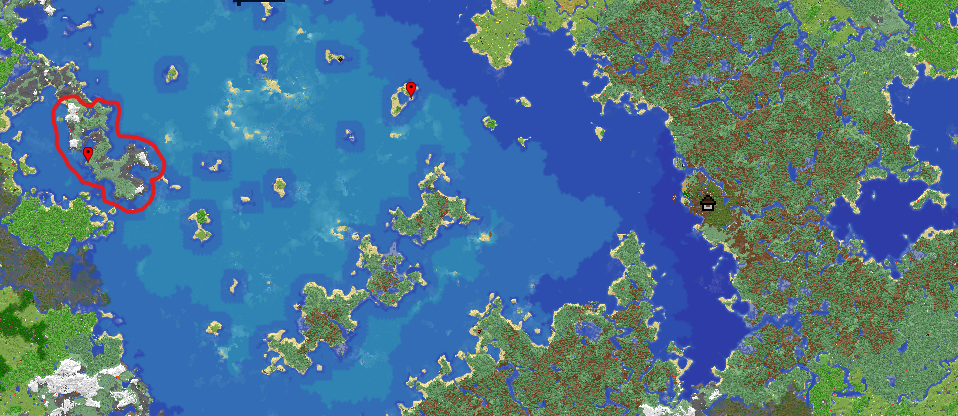

## **Évènement Jeux d'Horreur Mégalos World**

Bonjour les mégalos il est temps de préparer vos sacs à bonbons et dépoussiérer vos livres de sorts pour l'évènement Jeux d'Horreur sur le Mégalos World.

L'évènement à pour but de créer des attractions sur le thème de l'horreur. L'attraction principale sera une tour de dés à coudre version tour de l'horreur qui devra être construit en multi lors d'une soirée spécial. Des mini blocs seront aussi changer temporairement pour l'évènement et d'autres petites surprise arriveront pendant le mois d'octobre.

L'évènement débutera le **mercredi 1er Septembre** 17h (ouverture de la zone de construction) et se terminera le **samedi 31 octobre**.

**Position de la zone :** -2600 / ~~ / 60

> *Un portail est disponible dans le nether couloir ouest.*

**Liste des Attractions :**

- Dés à coudre (multi)
- Labyrinthe par Dwayne.
- Pitch out par Skings.
- Maison Hantée par Negumi et Sophie.
- Manoir Hanté cache cache par Dwayne.
- Tour Jump par Skings.

**MiniBlocs Temporaire**

- Livre Satanique.
- Crane de squelette avec du sang.
- Melon halloween.
- 